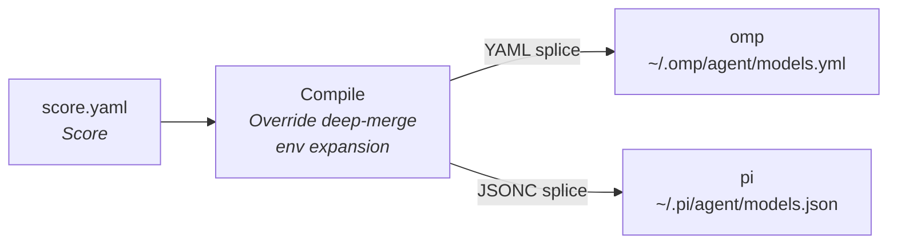

# Unisono (`unis`)

> **"One score. All agents in unison."**

A declarative, multi-agent LLM configuration compiler for open-source coding agents.

You maintain **one** file — the **Score** — and Unisono compiles it into each Agent's
native model **Catalog**. No runtime proxy, no per-Agent hand-editing, no drift.

The MVP supports two Agents: [omp](https://github.com/anthropics/omp) and [pi](https://github.com/badlogic/pi-mono).

## Why

Every coding Agent has its own model configuration file, in its own format, with its
own quirks. The moment you use more than one, you are maintaining the same provider
list in several places by hand, and they drift. Adding a model means editing N files,
and the one you forget is the one that breaks.

Unisono makes the Score the single source of truth and rewrites each Agent's Catalog
to match. The Catalog is owned by the tool; everything else in the config — themes,
MCP servers, default-model settings — is yours and is preserved.

## How it works



Three ideas carry the whole tool:

- **Takeover, not merge.** After a sync, an Agent's Catalog contains exactly what the
  Score compiles to, and nothing else. Providers the Score does not declare are
  deleted. The reasoning is in [ADR 0001](docs/adr/0001-takeover-instead-of-merge.md).
- **Byte-for-byte outside the Catalog.** Only the `providers` block is rewritten. The
  rest of the file is spliced in place, untouched — comments, formatting, and ordering
  included.
- **Idempotent.** If the compiled Catalog already equals what is on disk, a sync writes
  nothing and takes no snapshot.

> [!IMPORTANT]
> Takeover means hand-edited Catalog entries **do not** survive a sync. Move them into
> the Score — `unis import` seeds a draft from an existing Catalog to make that
> a five-second job.

## Install

Requires [Bun](https://bun.sh) 1.4+.

```bash
git clone https://github.com/unisono/unisono.git
cd unisono
bun link        # puts `unis` on your PATH
```

Or run it without linking:

```bash
bun run unis -- list
```

## Quickstart

```bash
# 1. Generate a draft Score from a config you already have
unis import              # interactively select omp or pi (↑/↓ + Enter)

# 2. Check it, then compile it into both Agents
unis validate
unis diff
unis sync
```

`unis sync` refuses a **first takeover** — a Catalog that holds Providers the Score
does not declare — and exits `2` until you confirm it:

```bash
unis sync          # exit 2: lists the Providers it would delete
unis sync --yes    # confirmed: snapshots both configs, then writes
```

## The Score

One file at `$XDG_CONFIG_HOME/unisono/score.yaml` (`~/.config/unisono/score.yaml` by
default):

```yaml
version: "1"

providers:
  deepseek:
    baseUrl: "https://api.deepseek.com/v1"
    apiKey: "${DEEPSEEK_API_KEY}"   # expanded at compile time; unset → error
    apiType: "openai-completions"
    headers: {}
    overrides:                      # Agent-specific native fields, deep-merged
      omp:
        compat:
          supportsDeveloperRole: false
    models:
      - id: "deepseek-chat"
        name: "DeepSeek V3"
        contextWindow: 65536
        maxTokens: 8192
        reasoning: false
```

- `${VAR}` is the only template syntax. Expansion happens before compilation, and a
  missing or empty variable aborts the run with no files written.
- `overrides.<agent>` holds fields one Agent understands and the other does not. The
  Score's own fields stay Agent-neutral; what cannot be expressed there lives here.
- `apiKey` is masked in all output: `sk-ab***12cd`.

## CLI

```bash
unis sync                 # compile the Score into both Agents' Catalogs
unis sync --yes           # confirm a first takeover
unis sync --dry-run       # preview the change, write nothing
unis diff                 # Score-compiled Catalog vs the on-disk Catalogs
unis validate             # check the Score and expand credential references
unis list                 # each Agent's path, presence, and Catalog counts
unis import               # interactively select an Agent and generate a Score draft
unis rollback             # restore the most recent snapshot
unis rollback --list      # list retained snapshots
unis rollback <ts>        # restore a specific snapshot
```

| Exit code | Meaning |
|---|---|
| `0` | success, or everything already unchanged |
| `1` | validation or write failure |
| `2` | first takeover refused (needs `--yes`, or `import` first) |

Output is plain line-oriented text with no ANSI escapes when piped or when `NO_COLOR`
is set. A converged sync completes in roughly 50 ms end to end, including interpreter
startup, against a 100 ms budget.

## Safety

Every write is guarded, and the guards are the point of the tool:

- **First-takeover interception** — deleting Providers you did not declare requires
  `--yes`.
- **Snapshot before every write** — the last 3 snapshots are retained under
  `$XDG_CONFIG_HOME/unisono/backups/`, and `unis rollback` restores byte-for-byte,
  including permissions.
- **Optimistic locking** — the file's SHA-256 is re-checked before the atomic
  `rename`; if something else changed it, the write aborts.
- **Symlink-safe** — the temporary file is created beside the real path, so a linked
  config stays linked.
- **Credential hygiene** — backup directories are `0700`, backup files and written
  configs `0600`, and keys are masked in every log line and diff.

After a takeover, settings that live *outside* the Catalog can point at a Provider
that no longer exists. Unisono detects this and warns — it does not edit them:

```
⚠ [Pi] settings.json defaultModel references removed provider 'old-proxy'
```

## Development

```bash
bun test          # 168 tests, 0 fail
bun run typecheck # tsc --noEmit
bun run lint      # biome check (lint + format + import order)
bun run format    # biome format --write
```

The test suite drives the real binary as a subprocess against a per-test temporary
tree and asserts the files, permissions, output, and exit codes it leaves behind — it
never imports internal modules.

Biome (`biome.json`) is configured to the style the code already used: 2-space indent,
double quotes, 80 columns. Two recommended rules are off — `noExplicitAny` (citty's
`CommandDef` typing) and `noTemplateCurlyInString` (the fixtures embed literal
`${VAR}` Score syntax).

## Documentation

- [Takeover ADR](docs/adr/0001-takeover-instead-of-merge.md) — why the Catalog is
  replaced rather than merged
- [CLI framework ADR](docs/adr/0002-citty-cli-framework.md) — why the Post-MVP CLI is
  driven by `citty`
- [Glossary](GLOSSARY.md) — Score, Agent, Provider, Model, Catalog, Takeover,
  Override, Sync
